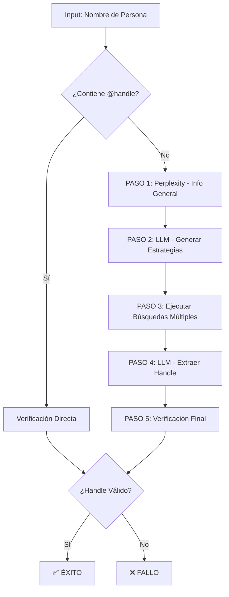

# 🎯 Pipeline Híbrido Inteligente para Resolución de Handles de Twitter

## Descripción General

El **Pipeline Híbrido Inteligente** es una solución avanzada para resolver handles de Twitter/X a partir de nombres de personas o entidades. Combina la búsqueda contextual de Perplexity con estrategias de búsqueda generadas por LLM y extracción automática de datos.

## Arquitectura del Pipeline



## Pasos del Pipeline

### 1. 🔍 Búsqueda de Información General (Perplexity)
- **Objetivo**: Obtener contexto sobre la persona (biografía, profesión, etc.)
- **Query**: `"Información sobre {nombre}: biografía, profesión, redes sociales, país, actividad pública"`
- **Resultado**: Información contextual que SIEMPRE se obtiene (nunca falla)

### 2. 🧠 Generación de Estrategias Inteligentes (LLM)
- **Objetivo**: Crear múltiples estrategias de búsqueda personalizadas
- **Input**: Información de la persona + nombre objetivo
- **Output**: 3-4 estrategias con diferentes enfoques:
  - Búsquedas site-specific (`site:twitter.com`)
  - Variaciones del nombre (con/sin tildes)
  - Términos profesionales contextuales
  - Búsquedas geográficas específicas

**Ejemplo de Estrategias Generadas:**
```json
{
  "strategies": [
    {
      "search_engine": "google",
      "query": "Diego España Guatemala twitter site:twitter.com",
      "priority": 9,
      "reasoning": "Búsqueda directa con ubicación y site-specific"
    },
    {
      "search_engine": "bing", 
      "query": "\"Diego España\" periodista Guatemala X perfil",
      "priority": 8,
      "reasoning": "Búsqueda con términos profesionales"
    }
  ],
  "expected_handle_patterns": ["@DiegoEspana", "@DiegoEspanaGT", "@DiegoEspanaNews"]
}
```

### 3. 🔍 Ejecución de Búsquedas Múltiples
- **Proceso**: Ejecutar cada estrategia en orden de prioridad
- **Implementación Actual**: Perplexity como proxy (futuro: APIs directas)
- **Tolerancia a Fallos**: Continúa aunque algunas búsquedas fallen
- **Rate Limiting**: Pausa de 1s entre búsquedas

### 4. 🧠 Extracción Inteligente de Handle (LLM)
- **Objetivo**: Analizar TODOS los resultados y extraer el handle más confiable
- **Input**: Resultados combinados de todas las búsquedas exitosas
- **Criterios de Evaluación**:
  - Menciones explícitas del handle
  - Correspondencia con el nombre objetivo
  - Fuentes oficiales (twitter.com/x.com)
  - Nivel de confianza (0-10)

**Ejemplo de Extracción:**
```json
{
  "handle": "DiegoEspana_",
  "confidence": 9,
  "evidence": "Encontrado en perfil oficial: twitter.com/DiegoEspana_ - Diego España, periodista guatemalteco",
  "source_strategy": "google site-specific search"
}
```

### 5. ✅ Verificación Final
- **Objetivo**: Confirmar que el handle extraído existe realmente
- **Método**: Requests HTTP a múltiples instancias de Nitter
- **Resultado**: Validación definitiva del handle

## Ventajas del Sistema

### 🎯 **Precisión Mejorada**
- **Múltiples enfoques**: No depende de una sola búsqueda
- **Validación cruzada**: Confirma resultados con múltiples fuentes
- **Confianza cuantificada**: Score de 0-10 para cada resultado

### 🧠 **Inteligencia Adaptativa**
- **Estrategias personalizadas**: Se adapta al contexto de cada persona
- **Aprendizaje contextual**: Usa información biográfica para mejorar búsquedas
- **Tolerancia a errores**: Funciona aunque algunas búsquedas fallen

### 📊 **Información Rica**
- **Contexto adicional**: Devuelve información biográfica
- **Trazabilidad**: Documenta qué estrategia fue exitosa
- **Métricas**: Número de intentos, fuentes consultadas

### ⚡ **Robustez**
- **Fallbacks múltiples**: Si falla Perplexity, usa información básica
- **Verificación final**: Confirma que handles existen realmente
- **Cache inteligente**: 30 días para éxitos, 12h para fallos

## Casos de Uso

### ✅ **Casos Exitosos**
```javascript
// Persona con perfil público conocido
"Diego España" → @DiegoEspana_ (confidence: 9)

// Figura política conocida  
"Bernardo Arévalo" → @BArevaloN (confidence: 10)

// Handle directo
"@realDonaldTrump" → realDonaldTrump (confidence: 10)
```

### ❌ **Casos de Fallo Controlado**
```javascript
// Persona inexistente
"Persona Fake Inventada" → NONE (method: hybrid_low_confidence)

// Handle inválido
"Nombre con Caracteres Raros" → ERROR (method: hybrid_invalid_handle)

// Sin evidencia suficiente
"Juan Pérez" → NONE (confidence: 3, evidence: "Múltiples Juan Pérez encontrados")
```

## Configuración y Uso

### Llamada Básica
```javascript
const laura = new LauraAgent();

const result = await laura.resolveTwitterHandle({
  name: "Diego España",
  context: "periodista guatemalteco", 
  sector: "comunicación"
}, user);

if (result.success) {
  console.log(`Handle encontrado: @${result.handle}`);
  console.log(`Confianza: ${result.confidence}/10`);
  console.log(`Evidencia: ${result.evidence}`);
} else {
  console.log(`Error: ${result.error}`);
}
```

### Respuesta Exitosa
```json
{
  "success": true,
  "handle": "DiegoEspana_",
  "confidence": 9,
  "method": "hybrid_intelligent_success",
  "resolved_username": "DiegoEspana_",
  "needs_profile": true,
  "evidence": "Perfil verificado en twitter.com/DiegoEspana_",
  "source_strategy": "google site-specific search",
  "search_attempts": 4,
  "person_info": "Diego España es un periodista guatemalteco...",
  "cache_duration": 2592000000
}
```

## Métricas y Monitoreo

### 📊 **KPIs del Sistema**
- **Tasa de éxito**: % de handles encontrados exitosamente
- **Tiempo promedio**: Latencia promedio por resolución
- **Confianza promedio**: Score promedio de confianza
- **Estrategias más exitosas**: Qué tipos de búsqueda funcionan mejor

### 🔍 **Debugging**
- **Logs detallados**: Cada paso documentado con timestamps
- **Información de fallo**: Qué estrategias fallaron y por qué
- **Traces de búsqueda**: Queries exactas ejecutadas

## Roadmap Futuro

### 🚀 **Mejoras Planificadas**
1. **APIs directas**: Integración con Google/Bing/DuckDuckGo APIs
2. **Cache distribuido**: Redis para cache compartido entre instancias
3. **ML scoring**: Modelos de ML para scoring de confianza
4. **Búsqueda en tiempo real**: Stream de actualizaciones de handles

### 🔧 **Optimizaciones**
1. **Paralelización**: Ejecutar búsquedas en paralelo
2. **Rate limiting inteligente**: Adaptar delays según API limits
3. **Estrategias aprendidas**: ML para generar mejores estrategias
4. **Verificación más rápida**: APIs directas de Twitter/X

---

## 🧪 Testing

Para probar el sistema:

```bash
cd ExtractorW
node test_hybrid_intelligent.js
```

Esto ejecutará test cases variados y mostrará métricas de rendimiento del pipeline híbrido inteligente. 