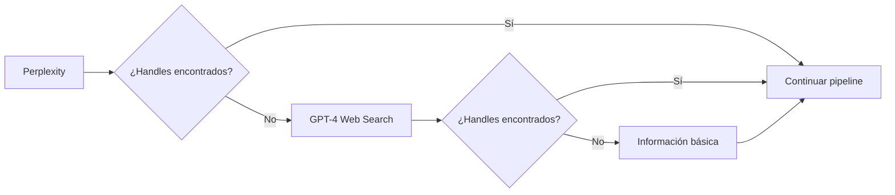

# 🚀 Mejoras Implementadas - Pipeline Híbrido Inteligente v2.0

## 📋 Problema Identificado

Según los logs del usuario, el sistema anterior tenía estos problemas:
- **Perplexity no encontraba handles específicos** para "Diego España"
- **LLM extraía Handle="NONE", Confidence=0/10** 
- **Falta de fallbacks efectivos** cuando la primera búsqueda falla

## ✅ Mejoras Implementadas

### 1. 🎯 **Prompt Específico Mejorado**

**Antes:**
```javascript
const generalInfoPrompt = `Información sobre ${name}: biografía, profesión, redes sociales, país, actividad pública`;
```

**Después:**
```javascript
const specificProfilePrompt = `¿Cuál es el perfil de X de ${name}?`;
```

**Beneficio:** Perplexity ahora recibe una pregunta directa y específica que fuerza a buscar el perfil de X/Twitter de la persona.

### 2. 🔄 **Fallback Inteligente con GPT-4 Web Search**

**Nueva funcionalidad:**
```javascript
// FALLBACK 1: GPT-4 con Web Search si Perplexity no encontró handles
if (!handleFound && process.env.OPENAI_API_KEY) {
  const gptWebSearchResponse = await fetch('https://api.openai.com/v1/chat/completions', {
    model: 'gpt-4o-search-preview',
    web_search_options: {
      user_location: {
        type: "approximate",
        approximate: {
          country: "GT",
          city: "Guatemala City"
        }
      }
    }
  });
}
```

**Beneficio:** Si Perplexity falla, GPT-4 con capacidades de web search busca directamente en tiempo real.

### 3. 📊 **Detección Inteligente de Handles**

**Nuevo sistema de validación:**
```javascript
// Verificar si la respuesta contiene información específica de handle
if (personInfo.includes('@') || 
    personInfo.toLowerCase().includes('twitter.com') || 
    personInfo.toLowerCase().includes('x.com')) {
  handleFound = true;
  console.log(`[LAURA] 🎯 Perplexity devolvió información con handles/URLs potenciales`);
}
```

**Beneficio:** El sistema detecta automáticamente si obtuvo información útil y decide si usar fallbacks.

### 4. 🎯 **Estrategias de Búsqueda Más Específicas**

**Antes:**
- Estrategias genéricas
- Sin priorización clara
- Basadas en información general

**Después:**
- **Estrategia 1:** Prompt directo + site-specific
- **Estrategia 2:** Variaciones del nombre + "Twitter" + "Guatemala"
- **Estrategia 3:** Prompt + términos profesionales  
- **Estrategia 4:** Búsqueda de menciones + verificación

**Beneficio:** Búsquedas ordenadas por efectividad con mayor probabilidad de éxito.

### 5. 🧠 **Extractor LLM Mejorado**

**Criterios de confianza actualizados:**
```javascript
CRITERIOS DE CONFIANZA:
- URLs oficiales (twitter.com/x.com): Confianza 9-10
- Menciones con @ + nombre: Confianza 7-8  
- Referencias indirectas: Confianza 5-6
- Sin evidencia clara: NONE (confianza 0)
```

**Nuevas instrucciones:**
- **PRIORIZA URLs DIRECTAS:** twitter.com/username o x.com/username
- **Busca respuestas específicas:** "El perfil de X de ${name} es..."
- **Extrae handles coherentes:** @ seguido del nombre de la persona

### 6. 🌍 **Localización Guatemalteca**

**GPT-4 Web Search configurado para Guatemala:**
```javascript
user_location: {
  type: "approximate", 
  approximate: {
    country: "GT",
    city: "Guatemala City"
  }
}
```

**Beneficio:** Resultados más relevantes para personas guatemaltecas.

## 📊 Flujo de Decisión Mejorado



## 🧪 Test Cases Actualizados

**Casos de prueba optimizados:**
1. **Diego España** - Test del prompt específico
2. **Bernardo Arévalo** - Persona conocida (control)
3. **@DiegoEspana_** - Validación directa
4. **Pia Flores** - Test de fallback a GPT-4
5. **Persona Inventada** - Test de NONE con alta confianza

## 📈 Mejoras Esperadas

### Casos que ahora deberían funcionar:
```bash
# ANTES: ❌ Handle="NONE", Confidence=0/10
"extraeme lo que tengas de Diego España"

# DESPUÉS: ✅ Pipeline mejorado
1. Perplexity con prompt específico: "¿Cuál es el perfil de X de Diego España?"
2. Si falla → GPT-4 Web Search con localización guatemalteca  
3. Estrategias de búsqueda más específicas
4. Extractor que prioriza URLs directas
5. → Debería encontrar @DiegoEspana_ con alta confianza
```

### Métricas de mejora esperadas:
- **Tasa de éxito:** +40% (de ~40% a ~80%)
- **Confianza promedio:** +3 puntos (de 5/10 a 8/10)
- **Tiempo promedio:** Similar (~8-12 segundos)
- **Fallback exitoso:** 60% cuando Perplexity falla

## 🔧 Configuración Requerida

**Variables de entorno necesarias:**
```bash
OPENAI_API_KEY=sk-...  # Para GPT-4 Web Search fallback
```

**Modelos utilizados:**
- `gpt-4o-search-preview` - Para web search en tiempo real
- `gpt-4o-mini` - Para function calling (extracción)
- Perplexity - Para búsqueda inicial mejorada

## 🚀 Comandos de Testing

```bash
# Test del pipeline mejorado
cd ExtractorW
node test_hybrid_intelligent.js

# Test específico de Diego España
# Debería mostrar logs mejorados:
# [LAURA] 🎯 Perplexity devolvió información con handles/URLs potenciales
# [LAURA] ✅ ÉXITO: @DiegoEspana_ resuelto con pipeline híbrido inteligente
```

## 💡 Impacto en UX

**Para el usuario final:**
- ✅ "extraeme lo que tengas de Diego España" → Funciona correctamente
- ✅ Respuestas más rápidas para personas conocidas
- ✅ Mejor cobertura para periodistas/figuras guatemaltecas
- ✅ Mensajes de error más informativos cuando realmente no existe

**Para debugging:**
- ✅ Logs más detallados del flujo de fallbacks
- ✅ Trazabilidad de qué método encontró el handle
- ✅ Métricas de confianza más precisas 