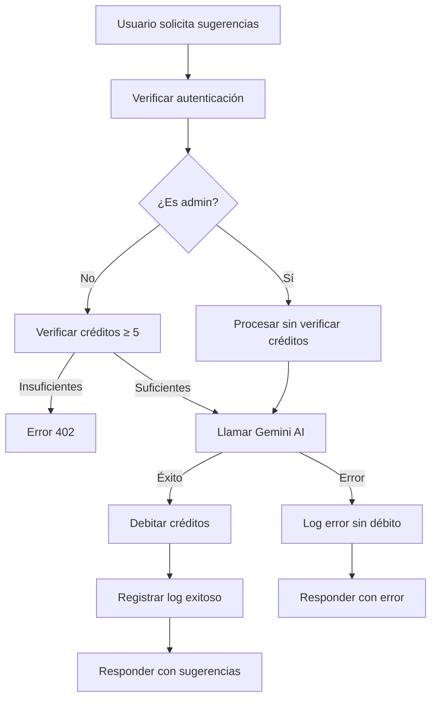

# Sistema de Créditos y Logging para Sugerencias de Proyecto

## 🚨 Implementación Completada

Se ha implementado un **sistema completo de créditos y logging** para el endpoint de sugerencias de proyecto (`/api/project-suggestions`).

## 💳 Sistema de Créditos

### Costo Fijo
- **5 créditos** por cada generación de sugerencias
- Verificación previa de créditos disponibles
- Débito automático tras generación exitosa
- **Acceso ilimitado para administradores**

### Flujo de Verificación
1. **Verificar créditos**: Usuario debe tener ≥ 5 créditos
2. **Generar sugerencias**: Llamada a Gemini AI
3. **Debitar créditos**: Actualizar tabla `profiles`
4. **Registrar log**: Guardar en `usage_logs`

### Manejo de Errores
- Si falla la verificación: Error 402 (Payment Required)
- Si falla el débito: Error 500 pero sugerencias generadas
- Si falla Gemini: Error 500 sin débito de créditos

## 📝 Sistema de Logging

### Información Registrada
```javascript
{
  user_email: "usuario@ejemplo.com",
  operation: "/api/project-suggestions", 
  credits_consumed: 5,
  request_params: {
    project_title: "Auditoría de contratos municipales",
    project_id: "uuid-123",
    decisions_count: 3,
    suggestions_count: 4,
    response_time: 2340,
    success: true
  },
  timestamp: "2025-01-16T20:00:00Z"
}
```

### Casos Especiales
- **Admin**: `credits_consumed: 0`, `admin_access: true`
- **Error**: `credits_consumed: 0`, `success: false`, `error: "mensaje"`

## 🔧 Endpoints Implementados

### 1. POST `/api/project-suggestions`
**Función**: Genera sugerencias con cobro de créditos
**Costo**: 5 créditos (gratis para admins)
**Autenticación**: Requerida (`verifyUserAccess`)

### 2. GET `/api/project-suggestions/cost`
**Función**: Obtiene información de costo
**Respuesta**:
```json
{
  "operation": "project-suggestions",
  "cost_credits": 5,
  "cost_description": "Generación de sugerencias inteligentes...",
  "user_credits": 45,
  "can_afford": true,
  "admin_access": false
}
```

### 3. GET `/api/project-suggestions/stats`
**Función**: Estadísticas de uso del usuario
**Respuesta**:
```json
{
  "total_suggestions_generated": 12,
  "total_credits_spent": 60,
  "last_generation": "2025-01-16T19:30:00Z",
  "recent_generations": [...]
}
```

## 🎯 Características del Sistema

### ✅ Verificación de Créditos
- Verificación previa antes de procesar
- Mensaje claro de créditos insuficientes
- Información de créditos requeridos vs disponibles

### ✅ Débito Seguro
- Transacción atómica en Supabase
- Rollback automático en caso de error
- Logging de todas las operaciones

### ✅ Logging Detallado
- Información completa del proyecto
- Número de decisiones y sugerencias generadas
- Tiempo de respuesta y estado de éxito
- Diferenciación entre usuarios normales y admin

### ✅ Manejo de Errores
- Logs de errores sin débito de créditos
- Mensajes de error descriptivos
- Manejo graceful de fallos de conectividad

## 🧪 Testing

### Script de Pruebas
```bash
cd ExtractorW
node test-suggestions-credits.js
```

### Escenarios Probados
1. **Verificación de costo**: Endpoint `/cost`
2. **Generación exitosa**: Con débito de créditos
3. **Créditos insuficientes**: Error 402
4. **Estadísticas de uso**: Endpoint `/stats`
5. **Diferentes tipos de proyecto**: Con/sin decisiones

## 📊 Integración con Admin Panel

### Dashboard de Créditos
Las sugerencias aparecen en:
- **Estadísticas por operación**: `/api/project-suggestions`
- **Logs de actividad**: Filtrable por operación
- **Top usuarios por consumo**: Incluye créditos de sugerencias

### Monitoreo
- Logs visibles en panel de administración
- Estadísticas de uso por usuario
- Tracking de costos y frecuencia de uso

## 🔄 Flujo Completo



## 🎯 Beneficios Implementados

### Para Usuarios
- **Transparencia**: Costo claro antes de generar
- **Control**: Verificación de créditos disponibles
- **Historial**: Estadísticas de uso personal

### Para Administradores
- **Monitoreo**: Logs completos de todas las operaciones
- **Análisis**: Estadísticas de uso por usuario
- **Control**: Acceso ilimitado sin restricciones

### Para el Sistema
- **Consistencia**: Mismo patrón que otros endpoints
- **Escalabilidad**: Sistema robusto de créditos
- **Auditabilidad**: Logs detallados para análisis

## 🔧 Configuración

### Variables de Entorno
```env
GEMINI_API_KEY=your_gemini_api_key_here
SUPABASE_URL=your_supabase_url
SUPABASE_SERVICE_ROLE_KEY=your_service_role_key
```

### Base de Datos
- Tabla `profiles`: Campo `credits` para débito
- Tabla `usage_logs`: Registro de operaciones
- Índices optimizados para consultas de estadísticas

---

> **Estado**: ✅ **COMPLETAMENTE IMPLEMENTADO**
> 
> El sistema de sugerencias ahora tiene control completo de créditos, logging detallado y endpoints de monitoreo, siguiendo las mejores prácticas del resto de la plataforma. 