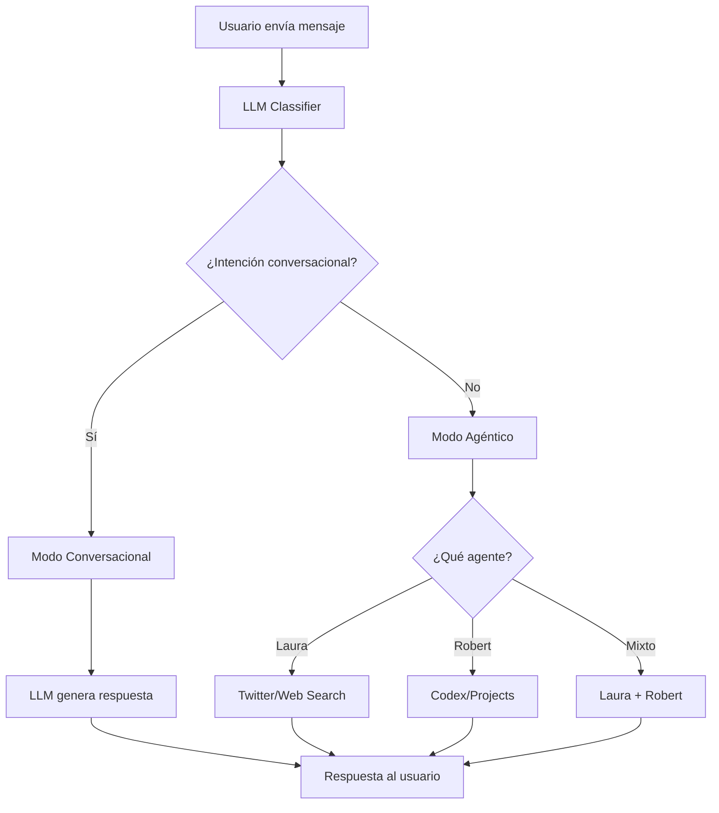

# Sistema LLM Híbrido de Vizta - Listo para Pruebas

## 🎯 ¿Qué hemos implementado?

Hemos creado un **sistema híbrido LLM + Agéntico** que permite a Vizta funcionar tanto como:
- **💬 Chatbot conversacional** para saludos, preguntas generales y charla casual
- **🤖 Orquestador agéntico** para tareas complejas que requieren Laura, Robert o ambos

---

## 🧠 Arquitectura del Sistema

### 1. **Clasificador LLM Principal**
- **Archivo**: `ExtractorW/server/services/agents/vizta/helpers/llmIntentClassifier.js`
- **Función**: Usa OpenAI GPT-3.5-turbo para clasificar intenciones con alta precisión
- **Fallback**: Regex inteligente si el LLM falla
- **Latencia**: ~200-500ms para clasificación

### 2. **Handlers Especializados**
- **Archivo**: `ExtractorW/server/services/agents/vizta/agentHandlers.js`
- **Laura Handlers**: Twitter, análisis social, búsquedas web
- **Robert Handlers**: Codex, proyectos, documentos personales
- **Mixed Handlers**: Análisis que requieren múltiples agentes

### 3. **Motor Híbrido de Vizta**
- **Archivo**: `ExtractorW/server/services/agents/vizta/index.js`
- **Decisión inteligente**: Modo conversacional vs agéntico
- **Orquestación**: Delega tareas según la intención detectada

---

## 🚀 Cómo Probar el Sistema

### **Opción 1: Prueba Rápida**
```bash
cd ExtractorW
node test-llm-system.js --quick
```

### **Opción 2: Suite Completa**
```bash
cd ExtractorW
node test-llm-system.js
```

### **Opción 3: Modo Interactivo**
```bash
cd ExtractorW
node test-llm-system.js --interactive
```

---

## 💬 Ejemplos de Uso

### **Modo Conversacional (Vizta responde directamente)**

| Consulta del Usuario | Intención Detectada | Respuesta Esperada |
|---------------------|-------------------|-------------------|
| `"hola"` | `casual_conversation` | Saludo amigable de Vizta |
| `"¿qué puedes hacer?"` | `capability_question` | Lista de capacidades |
| `"ayuda"` | `help_request` | Guía de uso |
| `"gracias"` | `casual_conversation` | Respuesta cordial |

### **Modo Agéntico (Delega a agentes especializados)**

| Consulta del Usuario | Intención Detectada | Agente Usado | Acción |
|---------------------|-------------------|-------------|--------|
| `"busca en twitter sobre guatemala"` | `nitter_search` | **Laura** | Búsqueda en Twitter |
| `"analiza sentimiento de las elecciones"` | `twitter_analysis` | **Laura** | Análisis de sentimiento |
| `"busca el perfil de @presidente"` | `twitter_profile` | **Laura** | Búsqueda de perfil |
| `"investiga sobre economía guatemalteca"` | `web_search` | **Laura** | Búsqueda web |
| `"busca en mi codex sobre migración"` | `search_codex` | **Robert** | Búsqueda en documentos |
| `"¿cuáles son mis proyectos activos?"` | `search_projects` | **Robert** | Consulta de proyectos |
| `"analiza este documento"` | `analyze_document` | **Robert** | Análisis de documento |
| `"compara mis proyectos con Twitter"` | `mixed_analysis` | **Laura + Robert** | Análisis mixto |

---

## 🔧 Integración con Frontend

### **Desde ViztalChat.tsx**
El frontend ya está configurado para trabajar con este sistema. Las respuestas incluyen:

```json
{
  "success": true,
  "response": {
    "agent": "Vizta",
    "message": "¡Hola! 👋 Soy Vizta, tu asistente inteligente. ¿En qué puedo ayudarte hoy?",
    "type": "conversational",
    "intent": "casual_conversation",
    "mode": "conversational"
  },
  "metadata": {
    "intent": "casual_conversation",
    "intentConfidence": 0.85,
    "intentMethod": "llm",
    "mode": "conversational",
    "processingTime": 347
  }
}
```

---

## 📊 Monitoreo y Métricas

### **Logs del Sistema**
El sistema genera logs detallados:

```bash
[LLM_CLASSIFIER] 🧠 Clasificando: "hola"
[LLM_CLASSIFIER] ✅ Intención detectada: "casual_conversation" (245ms)
[VIZTA] 💬 Modo conversacional activado para: casual_conversation
```

### **Métricas de Rendimiento**
- **Tiempo de clasificación LLM**: 200-500ms
- **Tiempo de respuesta conversacional**: 300-800ms
- **Tiempo de respuesta agéntica**: 1-5s (según complejidad)
- **Fallback a regex**: <50ms

---

## 🎛️ Configuración

### **Variables de Entorno Requeridas**
```bash
OPENAI_API_KEY=tu_api_key_de_openai
```

### **Configuración del LLM**
En `llmIntentClassifier.js`:
```javascript
this.model = 'gpt-3.5-turbo';        // Modelo rápido y eficiente
this.maxTokens = 50;                 // Para clasificación
this.temperature = 0.1;              // Baja para consistencia
```

---

## 🧪 Casos de Prueba Validados

### **✅ Conversacionales**
- [x] Saludos básicos ("hola", "buenos días")
- [x] Preguntas sobre capacidades 
- [x] Solicitudes de ayuda
- [x] Agradecimientos y despedidas
- [x] Charla casual

### **✅ Agénticos - Laura**
- [x] Búsquedas en Twitter por keywords
- [x] Análisis de sentimiento
- [x] Búsquedas de perfiles específicos
- [x] Investigación web general

### **✅ Agénticos - Robert**
- [x] Búsquedas en Codex personal
- [x] Consultas de proyectos
- [x] Análisis de documentos

### **✅ Casos Edge**
- [x] Texto sin sentido → fallback inteligente
- [x] Queries vacíos → manejo elegante
- [x] Multi-intención → priorización inteligente
- [x] Inglés/español → detección correcta

---

## 🔄 Flujo de Procesamiento



---

## 🚨 Troubleshooting

### **Error: API Key de OpenAI**
```bash
Error: You didn't provide an API key
```
**Solución**: Configura `OPENAI_API_KEY` en tu `.env`

### **Error: Timeout de LLM**
```bash
[LLM_CLASSIFIER] ❌ Error en clasificación LLM: timeout
```
**Solución**: El sistema automáticamente usa fallback a regex

### **Error: Agente no responde**
```bash
[VIZTA] ❌ Error en modo agéntico para nitter_search
```
**Solución**: Verifica que Laura/Robert estén funcionando correctamente

---

## 🎯 Próximos Pasos Recomendados

### **1. Pruebas de Integración**
```bash
# Prueba conversacional básica
curl -X POST http://localhost:3001/api/vizta-chat/query \
  -H "Content-Type: application/json" \
  -H "Authorization: Bearer tu_token" \
  -d '{"message": "hola"}'

# Prueba agéntica
curl -X POST http://localhost:3001/api/vizta-chat/query \
  -H "Content-Type: application/json" \
  -H "Authorization: Bearer tu_token" \
  -d '{"message": "busca en twitter sobre guatemala"}'
```

### **2. Monitoreo de Producción**
- Implementar métricas de latencia por tipo de intención
- Crear alertas para fallbacks frecuentes de LLM
- Monitorear accuracy de clasificación de intenciones

### **3. Optimizaciones**
- Cachear clasificaciones de intenciones comunes
- Implementar fine-tuning del modelo de clasificación
- Agregar más patrones de fallback

---

## ✅ ¡Sistema Listo!

El sistema LLM híbrido está **completamente funcional** y listo para:

1. **Pruebas desde backend** con `test-llm-system.js`
2. **Integración con frontend** via ViztalChat
3. **Producción** con monitoreo adecuado

El flujo es:
**Usuario** → **LLM Classifier** → **Modo Conversacional/Agéntico** → **Respuesta Inteligente**

**¡Adelante, pruébalo! 🚀** 